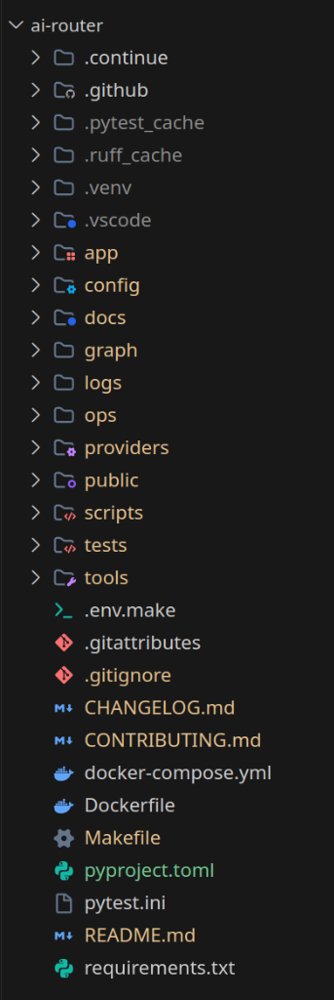
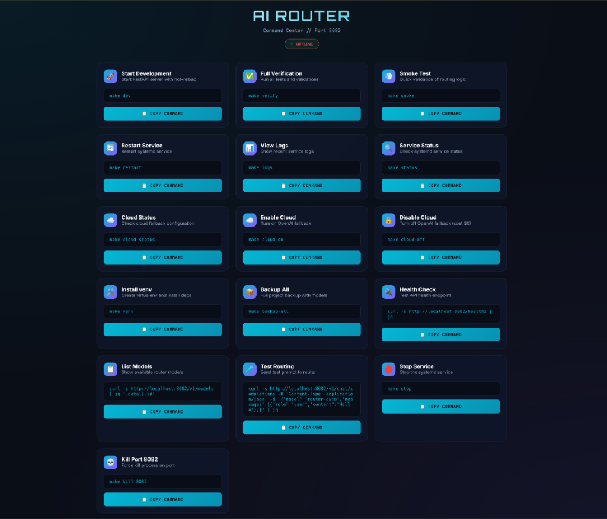

# 🧠 AI Router (Autonomous Judge)



A production-grade **Local/Cloud Hybrid Router** that intelligently routes prompts to the best model based on **Expertise** and **Cost**. It acts as a "Gatekeeper", sending simple tasks to your local GPU (Free) and only difficult tasks to the Cloud ($$$).

## 🖥️ Hardware Guide (Which Model for My GPU?)

This router uses **Ollama** for local inference. Choose your lineup based on your VRAM:

| GPU / VRAM | Tier | Recommended Models | Notes |
| :--- | :--- | :--- | :--- |
| **RTX 4090 (24GB)** | **God Tier** | `deepseek-coder-v2:16b`<br>`llama3.1:8b` | Can run logic + code locally. 95% offload possible. |
| **RTX 3060 (12GB)** | **Mid Tier** | `deepseek-coder:6.7b`<br>`llama3.1:8b-q4` | Good for chat, struggling with complex code. |
| **GTX 1060 / CPU** | **Low Tier** | `qwen2.5:1.5b`<br>`llama3.2:3b` | Strictly fallback. Use Cloud for 90% of tasks. |

> **Tip**: Edit `config/router_config.yaml` to change the `model` name to match what you installed.

## 🚀 Installation (Zero to Hero)

Follow these steps exactly to set up your router.

### Phase 1: Prerequisites
1.  **Install Python 3.12+**.
2.  **Install [Ollama](https://ollama.com)** and pull your models:
    ```bash
    # For RTX 4090 (24GB)
    ollama pull hermes3:8b
    ollama pull deepseek-coder-v2:16b
    ```

### Phase 2: Setup Repository
```bash
# 1. Create Virtual Environment
make venv

# 2. Setup Configuration
cp config/.env.local.example config/.env.local
# (Optional) Edit config/.env.local to add OPENAI_API_KEY if you want Cloud Fallback

# 3. Start the Server (Hot-Reload Mode)
make dev
```

### Phase 3: Verify
Open the [Command Center](http://localhost:8082/guide) or run:
```bash
# Run a quick smoke test
make smoke
```

---

## 🎮 Command Center (Dashboard)



Access the dashboard at **[http://localhost:8082/guide](http://localhost:8082/guide)**. It provides one-click copy for all commands.

### Common Commands
| Command | Action |
| :--- | :--- |
| `make dev` | Starts server in dev mode (Port 8082). |
| `make verify` | Runs full test suite (Lint + Unit + Integration). |
| `make cloud-on` | Enables Cloud Fallback (OpenAI). |
| `make cloud-off` | Disables Cloud Fallback (Local Only). |
| `make local-llama` | Tests the Local Llama model. |

## 📚 Documentation

| Guide | Purpose |
| :--- | :--- |
| **[Architecture](./docs/ARCHITECTURE.md)** | Deep dive into the **Autonomous Judge**, Expertise Matrix, and Model Roles. |
| **[Integration](./docs/INTEGRATION.md)** | How to connect **Web Clients**, **React**, and **VS Code (Continue)**. |
| **[Deployment](./docs/DEPLOYMENT.md)** | Production setup: **Docker**, Systemd, and Secrets. |
| **[Contributing](./CONTRIBUTING.md)** | Developer Guide: `make verify`, Testing, and adding models. |

---
*Built with ❤️ by the AI Router Team.*
