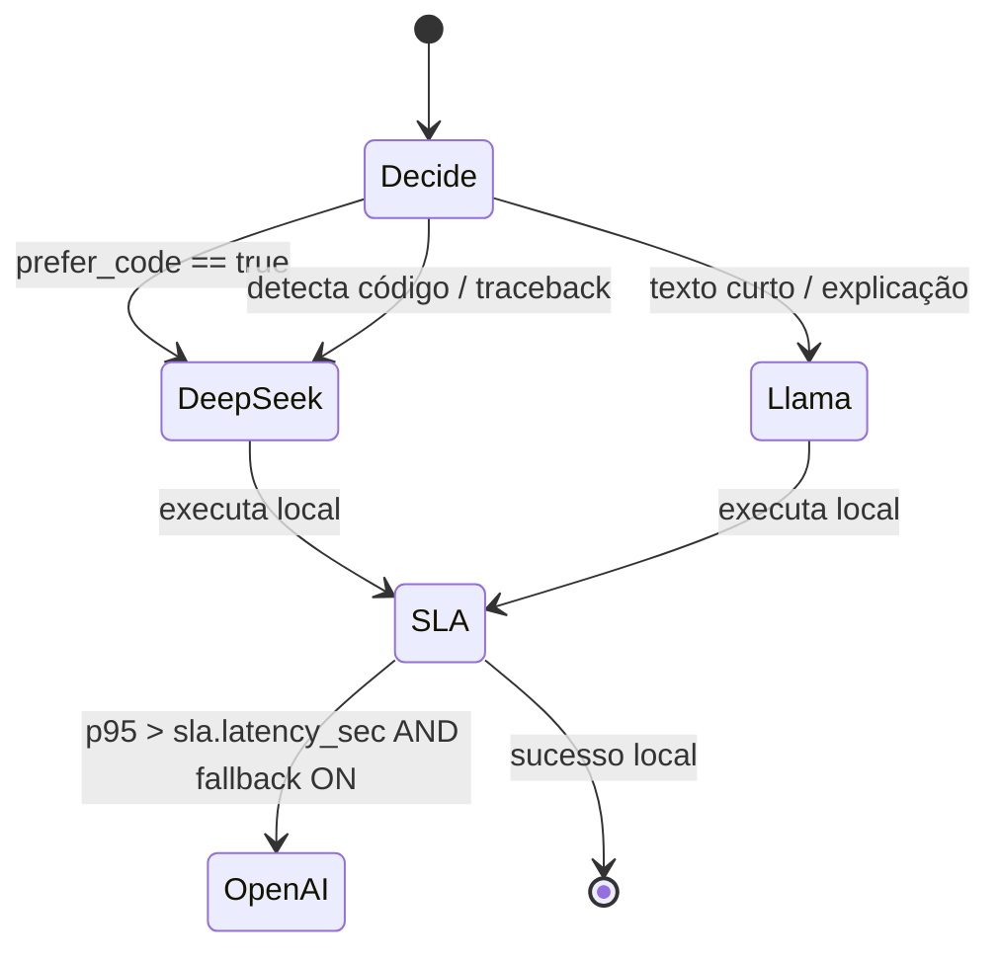
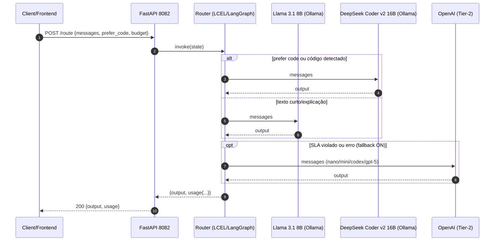

# Arquitetura

Componentes principais e fluxo de decisão. Minimalista, porém robusto.

> Diagramas Mermaid abaixo: compatível com renderização no GitHub.

## Componentes

- `app/` (FastAPI)
  - `GET/HEAD /healthz` — saúde do serviço.
  - `GET /debug/where` — módulos carregados, env ativo e caminhos.
  - `GET /v1/models` — compat OpenAI; IDs do registro de modelos.
  - `POST /route` — roteamento inteligente (Llama ↔ DeepSeek ↔ OpenAI fallback).
- `graph/router.py` — regras LCEL (`RunnableBranch`) em LangChain 1.0/LangGraph 1.0.
- `providers/`
  - `ollama_client.py` — cliente local (ChatOllama, `/api/chat`).
  - `openai_client.py` — fallback Tier‑2 (gpt‑5‑nano/mini/codex/gpt‑5).
- `config/`
  - `.env.local` — variáveis de ambiente (NÃO versionar).
  - `router_config.yaml` — registro de modelos (IDs e nomes reais).
  - `router_policy.yaml` — política de roteamento (heurísticas/SLA).
- `public/Guide.html` — painel web em `/guide` (auto‑sync com `/public/guide_cmds.json`).

Portas
- Produção (systemd): `8082`.
- Desenvolvimento (`make run-dev`): `8083` (sem conflitar com 8082).

## Fluxo (alto nível)

```mermaid
flowchart LR
    A[Client] --> B[FastAPI 8082]
    B --> C[Router<br/>LCEL / LangGraph]
    C -->|código / prefer_code| D[DeepSeek Coder v2 16B (Ollama)]
    C -->|texto curto / explicação| E[Llama 3.1 8B Instruct (Ollama)]
    C -->|SLA violado ou falha<br/>+ fallback ON| F[(OpenAI Tier‑2)]
    D --> G[(Resposta)]
    E --> G
    F --> G
```

Pré‑requisitos: Ollama em `http://localhost:11434` com os modelos já baixados (`ollama pull`).

## Árvore de decisão (resumo)



## Sequência de chamada



Observações
- O roteamento é local‑first por padrão; a nuvem é estritamente fallback.
- O painel (`/guide`) permite smokes e testes rápidos sem alterar a lógica.
- Não altere portas, unidades systemd, docker ou segredos via documentação.
